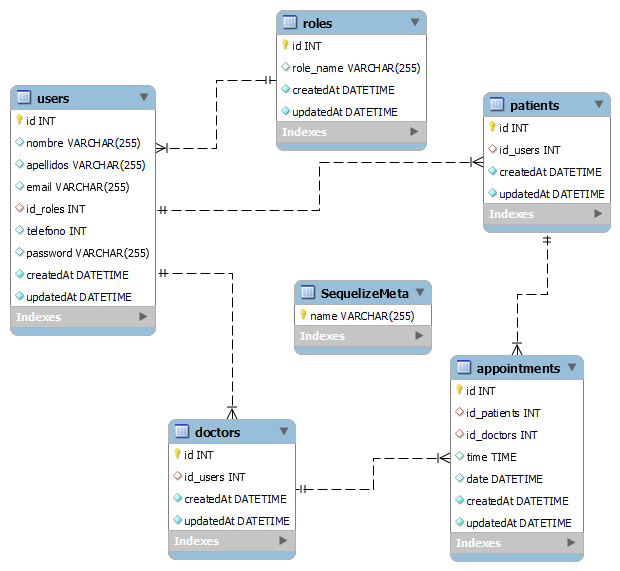

# Dental Clinic project

<details>
  <summary>Content 📝</summary>
  <ol>
    <li><a href="#objective">Objective</a></li>
    <li><a href="#about">About</a></li>
    <li><a href="#stack">Stack</a></li>
    <li><a href="#diagrama-bd">Diagrama</a></li>
    <li><a href="#instalation-on-local">Instalation on local</a></li>
    <li><a href="#endpoints">Endpoints</a></li>
    <li><a href="#license">License</a></li>
    <li><a href="#development">Development</a></li>
    <li><a href="#contact">Contact</a></li>
  </ol>
</details>

## Objective
The objective in this project requires to create in pairs a functional API connected to a database using sequelize and MySQL of a dental clinic.

## About
In order to do so, the customer must be able to register in the application, login & logout and access his customer area, all visually from within the application.
login & logout and access their customer area, all visually from the browser.
browser. In their customer area they should be able to see a list of future appointments, create, modify and cancel them.
appointments, create, modify and cancel them.
There will also be a user area with your personal data, which only you will be able to see.
only he will be able to see himself.
In addition, dentists must be able to register as professionals,
login and logout and see all appointments and registered patients.

## Diagrama BD



## Stack
Technoclogy used:
<div align="center">
<a href="https://sequelize.org/">
    
</a>
<a href="https://www.expressjs.com/">
    
</a>
<a href="https://nodejs.org/es/">
    
</a>
<a href="https://developer.mozilla.org/es/docs/Web/JavaScript">
    
</a>
<a href="https://www.mysql.com/">
    
</a>

 </div>


## Instalation on local
1. Start the repository
2. ` $ npm install `
3. Connect our repository to the database
4. ``` $ Sequelize: db:migration ``` 
5. ``` $ Sequelize: de:seed``` 
6. ``` $ npm run dev ``` 
7. ...

## Endpoints
<details>
<summary>Endpoints</summary>

- AUTH

  - REGISTER USER

          POST http://localhost:3000/auth/register

    body:

    ```js
        {
            "nombre": "Michael",
            "apellidos": "Scot",
            "email": "dunder@dunder.com",
            "telefono": "686543765",
            "password": "12345678"
        }
    ```
  - REGISTER DOCTOR (ADMIN)

          POST http://localhost:3000/auth/register

    body:

    ```js
        {
         "nombre": "Michael",
         "apellidos": "Scott",
         "email": "mifflin@mifflin.com",
         "telefono": "68747444",
         "password": "ryan1234"
         
    }
    ```


  - LOGIN

          POST http://localhost:3000/auth/login

    body:

    ```js
        {
            "email": "jimmy@jimmy.com",
            "password": "12345678"
        }
    ```

- USERS

  - SHOW PATIENT PROFILE (USE TOKEN)

         GET http://localhost:3000/users/profile

  - MODIFY USER (USAR TOKEN)

          PUT http://localhost:3000/users/profile/update

    body:

    ```js
    {
        "nombre": "Michael",
        "apellidos": "Scott",
        "email": "mifflin@mifflin",
        "telefono": "618560718",
        "password": "ryan123"
    }
    ```

  - CHECK APPOINTMENTS AS A PATIENT (USAR TOKEN)

          GET http://localhost:3000/users/appointments/checkall

  - CHECK APPOINTMENTS AS A DOCTOR (USAR TOKEN)

          GET http://localhost:3000/users/appointments/checkall/doctor

  - SHOW ALL PATIENTS AS ADMIN (USAR TOKEN)

          GET http://localhost:3000/users/profile/checkallpatients

  - SHOW ALL DOCTOR AS ADMIN (USAR TOKEN)

          GET http://localhost:3000/users/profile/checkalldoctors

- CITAS

  - CREATE APPOINTMENT AS PATIENT (USAR TOKEN)

        POST http://localhost:3000/appointment/patient

  - DELETE APPOINTMENT AS PATIENT (USAR TOKEN Y PASAR ID DE CITA)

        DELETE http://localhost:3000/appointment/:id

  - MODIFY APPOINTMENT AS PATIENT (USAR TOKEN Y PASAR ID DE CITA)

        PUT http://localhost:3000/appointment/:id

</details>

## License
This project is under licence from Luis Guerrer.

## Webgraphy:
To achieve my goal I have collected information from:

link to repositories
link to documentation of external libraries

## Development:

``` js
 const developer = "datata";

 console.log("Desarrollado por: " Antonio Toscano, Luis Guerrero Roquett);
```  


## Contact
<a href="https://github.com/luisroquett" target="_blank"></a> 
<a href = "mailto:luisguerreroroquett@gmail.com"></a>